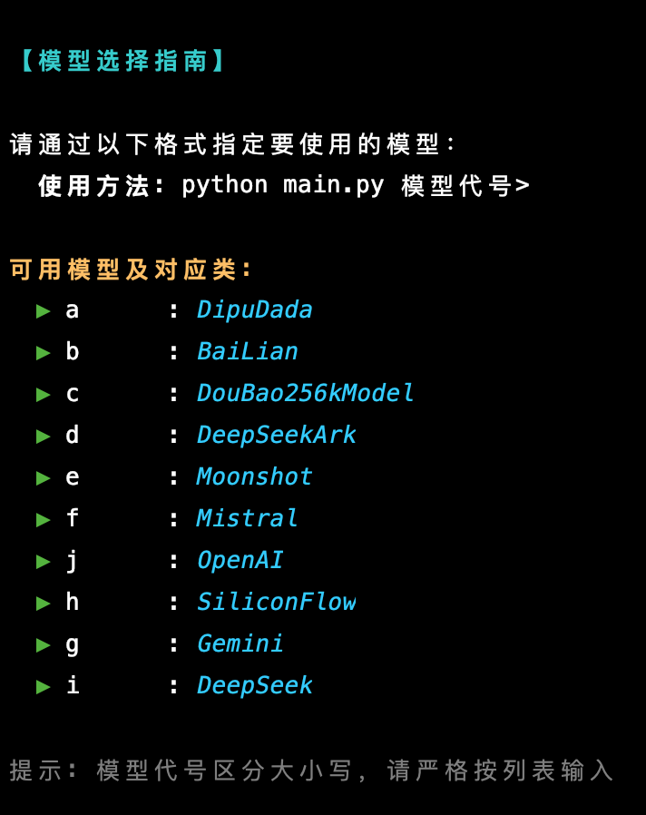
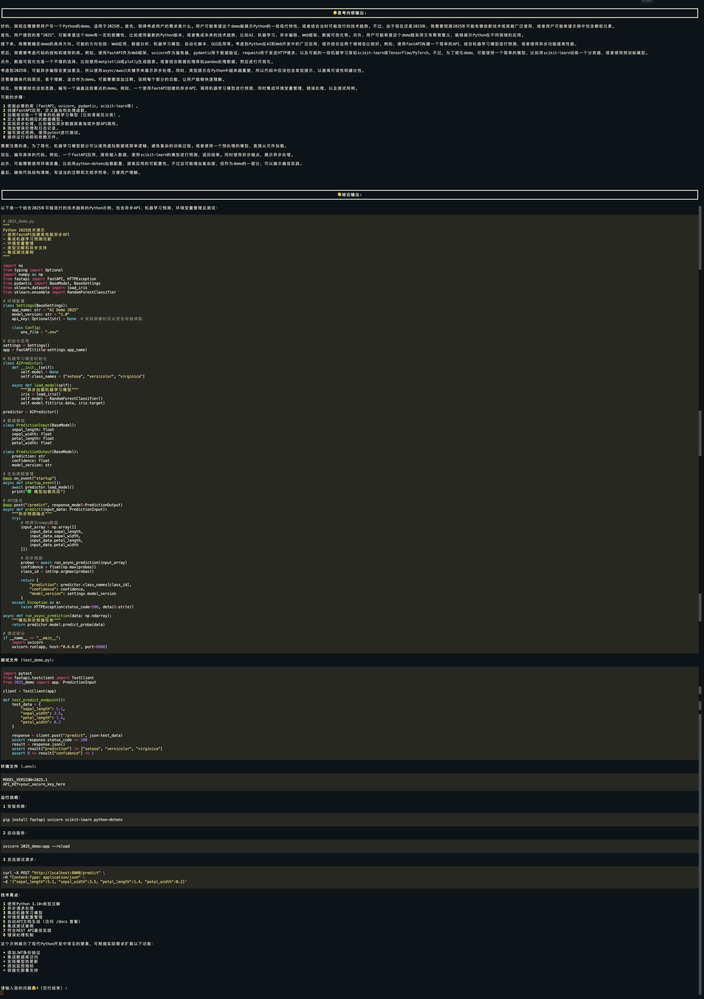
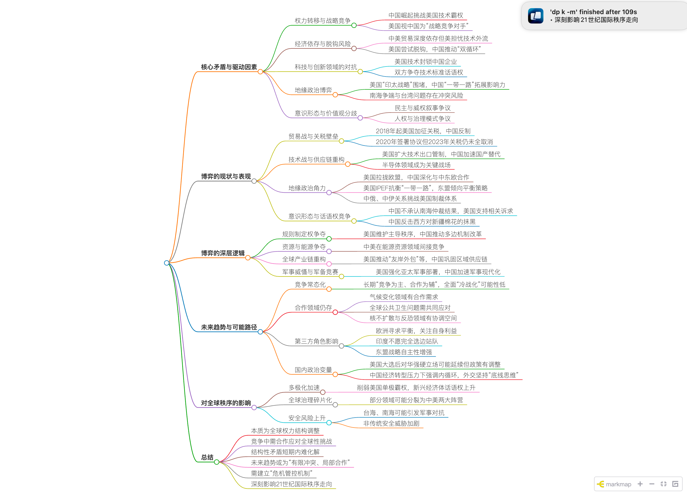

# AIGC 在终端内优雅的调用各种大模型
## 主要功能介绍
* 支持多种大语言模型，如：openai, mistral, volcengine, deepseek, ark, moonshot, siliconflow, ...
* 支持多种大模型总结为脑图功能
* 简单添加新模型，支持自定义模型调用

## 主要文件和模块说明
- main.py：项目的入口文件，负责解析命令行参数，根据用户选择的模型初始化相应的模型实例，并调用模型进行请求。
- param.py：用于解析命令行参数，处理用户输入的模型名称和是否生成脑图的选项，并进行参数验证。
- config.py：配置文件，包含模型映射配置和自定义脑图生成模型的配置。
- common/：公共模块，包含一些通用的工具函数，如获取用户输入、打印流式响应、保存 Markdown 文件和生成脑图等。
- dashscope/、deepseek/、openAI/ 等：不同模型的实现模块，每个模块包含具体模型的请求逻辑和初始化方法。
- tests/：测试模块，包含对 Markdown 文件保存和脑图生成功能的单元测试。


## 使用方式
### 1. 模型选择指南

```shell
    python main.py  -h
```



#### demo
```shell
    python main.py b
```


#### 效果


### 2. 总结为脑图功能
    加入 -m 参数，即可自动总结为脑图功能

#### demo
```shell
    python main.py b -m
```
#### 效果
提问

自动在浏览器打开脑图



## 快速开始 安装依赖

### 使用requirements.txt安装依赖（推荐）
```shell
    python -m pip install -r requirements.txt
```

### 手动安装依赖SDK（按需安装）
```shell
    python -m pip  install --upgrade "volcengine-python-sdk[ark]"  # 火山
    python -m pip  install -q -U google-generativeai               # 谷歌  
    python -m pip  install --upgrade 'openai>=1.0'                 # openai
    python -m pip  install --upgrade "mistralai"                   # mistral
    # 验证SDK 依赖包
    # python -c 'import openai; print("version =",openai.__version__)'
    
    # 总结脑图生成(可选，需要总结为脑图功能安装)
    brew install node
    node -v
    npm -v
```

## 配置本地环境变量
### mac Or Linux
```shell
    export DASHSCOPE_API_KEY="your_api_key_here"    # 阿里百炼
    export DEEP_SEEK_API_KEY="your_api_key_here"    # deepseek
    export GOOGLE_API_KEY="your_api_key_here"       # 谷歌
    export MISTRAL_API_KEY="your_api_key_here"      # Mistral
    export OPENAI_API_KEY="your_api_key_here"       # openai
    export ARK_API_KEY="your_api_key_here"          # 火山
    export MOONSHOT_API_KEY="your_api_key_here"     # 月背
    export SILICON_FLOW_API_KEY="your_api_key_here" # SiliconFlow
```

## 自定义脑图生成模型
```python
# 调整 config.py 中的配置 , 默认是豆包 , 你必须配置有效的模型, 推荐配置免费如gemini 或较为便宜的模型
MODEL_GENERATE_MIND = "c" 
```

## 新增模型
项目使用工厂模式 , 你只需要添加一个模型类和修改 config.py 中的配置即可

## 根据上述 demo 开始愉快玩耍吧😄